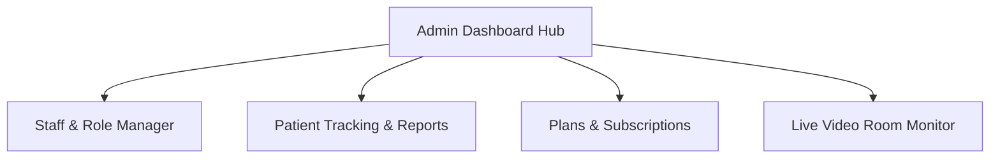

# Production-Grade Admin Portal Specification

This document defines the technical design, database schema, API requirements, and frontend modules needed to build a secure, production-grade Admin Portal for 8Liv.

---

## 1. Role-Based Access Control (RBAC) Architecture

To secure admin actions, the application must verify the user's role on both the client (Next.js middleware/guards) and the server (API routes, Supabase policies).

### Database Schema Updates

```sql
-- Ensure profiles table has a role column
ALTER TABLE public.profiles 
  ADD COLUMN IF NOT EXISTS role TEXT DEFAULT 'patient' 
  CHECK (role IN ('admin', 'doctor', 'dietitian', 'trainer', 'patient'));

-- Create care team assignments table to track patient relationships
CREATE TABLE public.care_team_assignments (
  id UUID PRIMARY KEY DEFAULT gen_random_uuid(),
  patient_id UUID NOT NULL REFERENCES public.profiles(id) ON DELETE CASCADE,
  doctor_id UUID REFERENCES public.profiles(id) ON DELETE SET NULL,
  dietitian_id UUID REFERENCES public.profiles(id) ON DELETE SET NULL,
  trainer_id UUID REFERENCES public.profiles(id) ON DELETE SET NULL,
  assigned_at TIMESTAMPTZ DEFAULT now(),
  updated_at TIMESTAMPTZ DEFAULT now(),
  CONSTRAINT unique_patient_assignment UNIQUE (patient_id)
);

-- Row Level Security (RLS) for Assignments
ALTER TABLE public.care_team_assignments ENABLE ROW LEVEL SECURITY;

CREATE POLICY "Admins have full control on assignments"
  ON public.care_team_assignments
  FOR ALL
  TO authenticated
  USING (
    EXISTS (
      SELECT 1 FROM public.profiles 
      WHERE id = auth.uid() AND role = 'admin'
    )
  );

CREATE POLICY "Patients can view own assignment"
  ON public.care_team_assignments
  FOR SELECT
  TO authenticated
  USING (auth.uid() = patient_id);

CREATE POLICY "Care team members can view assigned patients"
  ON public.care_team_assignments
  FOR SELECT
  TO authenticated
  USING (
    auth.uid() = doctor_id OR 
    auth.uid() = dietitian_id OR 
    auth.uid() = trainer_id
  );
```

---

## 2. Plan & Subscription Offer Architecture

To support dynamic pricing, discounts, and plan specifications without code redeployment, the frontend must fetch plan tiers from a database table rather than using static constants.

### Database Schema

```sql
CREATE TABLE public.membership_plans (
  id UUID PRIMARY KEY DEFAULT gen_random_uuid(),
  name TEXT NOT NULL UNIQUE,          -- 'Silver Plan', 'Gold Plan'
  price_monthly NUMERIC(10,2) NOT NULL,
  consultation_fee NUMERIC(10,2) DEFAULT 499.00,
  features TEXT[] NOT NULL,           -- ['Bi-weekly video consultations', 'Priority chat']
  is_active BOOLEAN DEFAULT true,
  discount_code TEXT,
  discount_percent INTEGER DEFAULT 0,
  created_at TIMESTAMPTZ DEFAULT now(),
  updated_at TIMESTAMPTZ DEFAULT now()
);

-- Enable RLS
ALTER TABLE public.membership_plans ENABLE ROW LEVEL SECURITY;

-- Allow public/authenticated read for checkouts
CREATE POLICY "Anyone can view active plans"
  ON public.membership_plans FOR SELECT
  USING (is_active = true);

-- Allow full write for admins only
CREATE POLICY "Admins have write access on plans"
  ON public.membership_plans FOR ALL
  TO authenticated
  USING (
    EXISTS (
      SELECT 1 FROM public.profiles 
      WHERE id = auth.uid() AND role = 'admin'
    )
  );
```

---

## 3. Backend API Endpoints (Admin Secured)

All admin API endpoints must verify that the requesting user's profile role is `'admin'`.

### A. Staff Creation and Role Management (`/api/admin/users`)
* **Purpose**: Register doctors, dietitians, trainers, or new admins. This must be done using the Supabase Service Role client (`supabaseAdmin.auth.admin.createUser`) to bypass standard email verification blocks.
* **POST Parameters**:
  ```json
  {
    "email": "dr.priya@8liv.com",
    "password": "temporaryPassword123",
    "role": "doctor",
    "firstName": "Priya",
    "lastName": "Sharma",
    "phoneNumber": "+919999999999"
  }
  ```
* **Internal Logic**:
  1. Verify the requester's admin claim.
  2. Call `supabaseAdmin.auth.admin.createUser` to create the account.
  3. Insert/update the corresponding `profiles` row with the designated role.
  4. If the role is `'doctor'`, insert a slot into the `doctor_profiles` table.

### B. Plan Operations (`/api/admin/plans`)
* **Purpose**: Create, update, or deprecate subscription plans.
* **POST/PUT Parameters**:
  ```json
  {
    "name": "Platinum Plan",
    "priceMonthly": 2999.00,
    "consultationFee": 0.00,
    "features": ["Weekly consultation", "24/7 Priority Concierge"],
    "isActive": true
  }
  ```

### C. Care Team Assignments (`/api/admin/assignments`)
* **Purpose**: Allocate doctors, dietitians, and trainers to a patient.
* **POST Parameters**:
  ```json
  {
    "patientId": "UUID",
    "doctorId": "UUID",
    "dietitianId": "UUID",
    "trainerId": "UUID"
  }
  ```
* **Internal Logic**:
  * Write to `care_team_assignments` (upserting where `patient_id` matches).
  * Insert a notification to the patient's feed: `"Your Care Team has been updated. You are now assigned to Dr. Priya Sharma."`

### D. Patient Report Generator (`/api/admin/reports`)
* **Purpose**: Aggregate patient telemetry (current weight, starting weight, adherence to medication, session attendance) and generate report formats.
* **GET Parameters**: `format=csv` or `format=json`.
* **Internal Logic**:
  * Join `profiles`, `health_assessments`, and `progress_logs` to calculate weight lost percentages.
  * Return structured logs for spreadsheet export.

---

## 4. Frontend Admin Dashboard Modules

The admin dashboard (accessible at `/admin` or `/admin/dashboard`) should be styled with a clean, dark theme and contain the following modules:



### Module 1: Staff & Role Manager
* **Staff Directory Grid**: Lists all registered staff (Doctors, Dietitians, Trainers, Admins).
* **Creation Form Modal**: Inputs details (Name, Email, Role) to register staff accounts.
* **Role Modifiers**: A dropdown on any user card to quickly promote, demote, or suspend accounts.

### Module 2: Patient Monitoring & Status Reports
* **Biometric Grid**: Lists patients showing membership tier, starting weight, last logged weight, weight lost, and medication status.
* **Report Generator**: A button saying `"Export Patient Roster (CSV)"` that fetches data from `/api/admin/reports` and triggers a browser download.

### Module 3: Subscription & Offers Manager
* **Plans List**: Shows all active membership tiers.
* **Pricing Editor Form**: Allows modification of prices, features list, and promotional discounts (e.g. 15% discount code).

### Module 4: Consultation Allocation Engine
* **Allocation Modal**: For any patient, displays lists of available doctors, dietitians, and trainers. Includes a dropdown selection to instantly assign their care team.

### Module 5: Live Video consultation Monitor
* **Active Sessions List**: Queries `doctor_consultations` where `status = 'scheduled'` and checks if the slot is today.
* **Room Monitoring Panel**: Connects to the Daily.co API (e.g., `/api/admin/rooms`) to display whether the room is currently active, who is connected (doctor, patient, or both), and duration elapsed.

---

## 5. Security & Router Guards

To guarantee production-grade safety:
1. **Next.js Middleware Check**: intercept requests to `/admin` and confirm the user session cookie indicates `user_role === 'admin'`. If not, redirect to `/login` or throw a forbidden error.
2. **Postgres RLS Enforcements**: Enable row-level security on all administrative tables, checking `role = 'admin'` in `profiles`.
